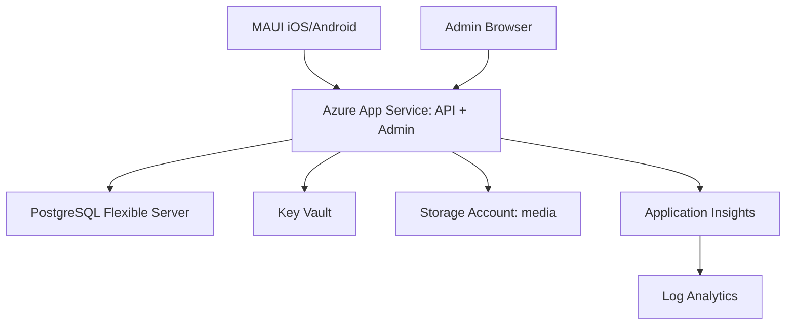

# Infraestructura y Terraform

Este documento explica la infraestructura del proyecto con una mirada practica. La idea es que puedas leer los `.tf` sin sentir que Terraform esta haciendo magia negra.

## Modelo mental de Terraform

Terraform compara tres cosas:

- **Codigo deseado**: los archivos `.tf`.
- **Estado actual conocido**: el `terraform.tfstate`.
- **Infraestructura real**: lo que existe en Azure.

Con eso arma un plan:

- `terraform plan`: muestra que crearia, cambiaria o destruiria.
- `terraform apply`: ejecuta el plan.
- `terraform destroy`: elimina lo que esta en el state.

Regla de oro: `plan` se lee siempre antes de `apply`.

## Archivos principales

- `versions.tf`: fija Terraform y providers. El provider `azurerm` habla con Azure.
- `variables.tf`: inputs configurables. Es el contrato de la infraestructura.
- `main.tf`: recursos Azure que queremos crear.
- `outputs.tf`: datos utiles despues de crear recursos, como URL de la API.
- `terraform.tfvars.example`: ejemplo para crear tu `terraform.tfvars`.
- `.terraform.lock.hcl`: lock de providers generado por `terraform init`; debe versionarse.

## Que es el state

Terraform state es un archivo que mapea recursos del codigo a recursos reales.

Ejemplo conceptual:

```text
azurerm_linux_web_app.api -> app-tc-dev-abc123 en Azure
```

Ese state contiene datos sensibles, especialmente si hay passwords o connection strings. Por eso:

- no se commitea `*.tfstate`;
- en dev local puede vivir en tu maquina;
- para equipo/prod conviene usar backend remoto en Azure Storage.

## Recursos Azure del MVP

Terraform tiene un interruptor de seguridad:

- `allow_paid_resources = false`: modo base/minimo para explorar Terraform con el menor riesgo de costo.
- `allow_paid_resources = true`: modo MVP cloud completo.

En modo base/minimo se crean:

- Resource Group.
- Storage Account y container privado `media`.
- Key Vault.
- Log Analytics Workspace.
- Application Insights.

En modo MVP cloud completo se agregan:

- Linux App Service Plan.
- Linux Web App.
- Azure Database for PostgreSQL Flexible Server.
- Base PostgreSQL `travel_companion`.
- Secretos productivos en Key Vault.



## Por que estos recursos

- **App Service**: forma simple de hostear ASP.NET Core sin administrar servidores.
- **PostgreSQL Flexible Server**: base relacional administrada compatible con nuestro EF Core/Npgsql.
- **Key Vault**: separa secretos del codigo y de Git.
- **Storage Account**: lugar natural para imagenes, vouchers y media.
- **Application Insights**: telemetria, errores y performance.
- **Log Analytics**: workspace donde vive la observabilidad.

## Flujo local recomendado

```powershell
cd infra\terraform
Copy-Item terraform.tfvars.example terraform.tfvars
```

Conservar `allow_paid_resources = false` mientras quieras solo revisar/crear la base minima. En ese modo no hace falta completar passwords productivos.

Antes de habilitar `allow_paid_resources = true`, revisar costos estimados. App Service Plan y PostgreSQL Flexible Server son los recursos principales con costo sostenido mientras existen.

Para observabilidad, dev queda con cotas bajas de ingesta:

- `log_analytics_daily_quota_gb = 0.1`
- `app_insights_daily_cap_gb = 0.1`
- `app_insights_sampling_percentage = 10`
- retencion minima configurada: `30` dias en Log Analytics y App Insights

Tambien se crean alertas de budget por Resource Group (mensual) con umbrales 50%, 80% y 100% para evitar sorpresas en free trial.

Despues:

```powershell
terraform init
terraform fmt -recursive
terraform validate
terraform plan
```

## Azure DevOps pipeline

El repositorio incluye `azure-pipelines.yml` para empezar CI/CD sin activar despliegues costosos por accidente.

La pipeline hace tres cosas:

- compila la API con .NET 10;
- valida Terraform sin backend remoto;
- opcionalmente genera un `terraform plan` de dev como artifact.

El plan de Terraform es manual mediante el parametro `runTerraformPlan`. Por defecto queda apagado, asi un push normal no intenta hablar con Azure ni crear recursos.

Para que el plan funcione en Azure DevOps hay que crear una service connection hacia Azure y reemplazar en el YAML:

```text
TODO-AZURE-SERVICE-CONNECTION
```

La pipeline no tiene etapa de `apply`. Ese paso sigue siendo manual hasta que decidamos controles de ambiente, aprobaciones y presupuesto.

Solo si el plan se ve correcto y queres crear esos recursos:

```powershell
terraform plan -out tfplan
terraform apply tfplan
```

## Comandos seguros

- `terraform fmt -recursive`: formatea.
- `terraform validate`: valida sintaxis y schema.
- `terraform plan`: muestra cambios sin aplicarlos.
- `terraform output`: muestra outputs.

## Comandos que modifican infraestructura

- `terraform apply`: crea/cambia recursos.
- `terraform destroy`: borra recursos.
- `terraform import`: mete recursos existentes en el state.
- `terraform state rm`: saca recursos del state sin borrarlos en Azure.

## Ambientes

El input `environment` define el ambiente:

- `dev`: pruebas.
- `staging`: ensayo antes de prod.
- `prod`: usuarios y datos reales.

Cada ambiente deberia tener su propio state. Para empezar podemos trabajar con `dev` local. Antes de prod, conviene crear backend remoto.

## Decisiones actuales

- El default de Terraform evita crear App Service y PostgreSQL para cuidar creditos del free trial.
- Empezamos con endpoint publico de PostgreSQL + firewall para mantener simple el MVP.
- App Service accede a Postgres usando la regla `AllowAzureServices`.
- Los secretos se guardan en Key Vault y la Web App los lee con Managed Identity.
- El deploy del codigo todavia no lo hace Terraform; Terraform crea infraestructura. La primera pipeline Azure DevOps compila y valida, pero no publica ni aplica cambios.

## Hardening futuro

Cuando haya usuarios reales y pagos:

- backend remoto para Terraform state en Azure Storage;
- Private Endpoint para PostgreSQL;
- VNet Integration para App Service;
- dominios custom y certificados;
- staging slot en App Service;
- backups/retention definidos por ambiente;
- alerts de errores 5xx y latencia;
- CI/CD con Azure DevOps para publicar API/Admin con aprobaciones por ambiente.
